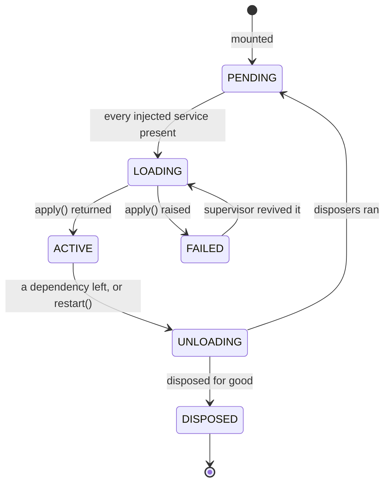

# Kernel architecture — the anchor

The horizontal contract every sprint conforms to. Specs point at this with
`anchors: [kernel-architecture]`; it points at nothing downstream.

## The one idea

**A registration returns its own undo, and something owns the undo.**

Everything else in this kernel is a consequence. Hot reload is not a feature —
it is what you get for free once unload is total. Dependency-driven activation is
not a scheduler — it is what you get once a plugin's lifetime is a first-class
object that can be stopped and started.

Frameworks that give a component a lifecycle without giving it ownership do not
have this. A component declares what it offers, the framework wires it, and
teardown is whatever a `deactivate` method remembered to do.
Nothing owned the undo of a route the component registered, a listener it added,
a connection it opened. So unload was best-effort, and hot reload had to be
built.

## The four concepts

| Concept | What it is |
|---|---|
| **Context** (`ctx`) | A lookup table of services, plus a scope. Every plugin gets its own. |
| **Service** | Something registered on a context under a name. `ctx.tools`, `ctx.config`. |
| **Plugin** | A callable that receives a context and registers things. |
| **Fiber** | One mounted plugin and everything it registered. The unit of lifetime. |
| **Effect** | A registration paired with its undo. Owned by a fiber. |

A plugin is not an object with a lifecycle interface. It is a function that runs
once and returns a disposer. The fiber holds the disposer.

## The tiers

Four levels, ordered by what may depend on what.

```
plugkit/
  cordis/        the kernel — nothing above it may be assumed present
  binding.py     the kernel-aware wiring layer (provide, @plugin)
  signals.py     a standalone reactive library — imports nothing
  services/      ordinary plugins with NO privileged status
```

**There is no platform tier.** Config is a plugin. Tools are a plugin. A
composition may mount none of the shipped services and still be a working kernel.
Calling a service "platform" implies the kernel needs it, and the kernel needs
none of them.

The kernel's only built-in service is `ctx.logger`, and it earns that place for
exactly one reason: the fiber must be able to report its own load failure, and it
cannot inject a service to do so.

**Rule: nothing in `cordis/` may import from `services/`.** A dependency running
that direction would make a service load-bearing, which is the tier this design
deleted.

## The lifecycle contract

A fiber is in one of six states. The transitions are driven by one value.



**The epoch** is that one value: a digest of the *identities of the fibers
providing* each injected service. Not the values — the providers. When any
provider is replaced by a different fiber, the digest changes, and the dependent
unloads and re-applies.

That is the whole hot-reload mechanism. It is why swapping a service
implementation propagates without anyone writing propagation code, and why the
propagation is correct rather than best-effort: the dependent is *rebuilt*, not
patched.

## What crosses each boundary

| Boundary | What crosses | Direction |
|---|---|---|
| plugin → kernel | `inject` (names it needs), registrations (each returning a disposer) | plugin declares, kernel calls |
| kernel → plugin | `ctx`, and its plugin config | once per activation |
| plugin → plugin | never directly. Only through a named service, or an event | via the kernel |
| service → caller | a *rebound* service view whose `self.ctx` is the **caller's** context | on every read |

That last row is the subtle one and it is load-bearing. When plugin A reads
`ctx.tools` and calls `ctx.tools.register(t)`, the registration is owned by **A's**
fiber, not the tools plugin's. So when A unloads, its tool disappears — even
though the registry belongs to someone else. Without this, every registry would
need its own ownership bookkeeping and would get it subtly wrong.

**The Python-specific hazard this creates:** the rebinding walks attribute
access, so it must distinguish a *method* (rebind onto the caller's view) from
*data that happens to be callable* (leave alone). JavaScript has no such
distinction — only functions are callable there. The discriminator is whether the
name lives in the instance `__dict__`. Getting this wrong turns a stored callback
into a function invoked with the view as its first argument, silently. It has
been got wrong twice; see `VENDORED.md`.

## Config: values propagate, providers reload

Two mechanisms, deliberately different granularity:

| Change | Mechanism | Why |
|---|---|---|
| a service *provider* is replaced | epoch → unload + re-apply the dependents | the object identity changed; a dependent holding the old one is holding a stale reference |
| a config *value* changes | a Signal per dotted key → re-run the effects that read it | reloading a plugin to observe a new timeout is a sledgehammer |
| a config value a **constructor argument** was built from changes | the binding restarts its own fiber | a constructor argument cannot be mutated after construction; the honest response is a new object |

Row three is where the two meet, and it is why `binding.provide` reaches for
`ctx.reactive` through `ctx.inject` rather than its own `inject`: a composition
with no `ReactiveService` must still boot, just without live config rebuilds.

## Permission: monotonic or it is not a rule

Any gate this kernel grows follows `ctx.tools`'s shape:

- A **veto** stage may deny, allow, or ask.
- A **guard** stage may only deny. It has no allow return value.

The second is not a simplification, it is the point. If a guard could allow, then
registration order would decide the answer, and a rule would become a
suggestion — a later plugin could undo an earlier plugin's denial by loading
after it. With no allow, order cannot change the outcome.

The same rule applies to any future `fs/*` or network gate. If you find yourself
adding an allow to a guard, you are building a veto stage and should say so.

## What is deliberately absent

- **No component base class requirement.** A component is a plain class. The
  kernel-aware layer is the binding, not the component.
- **No trait system.** Auto-derived capability labels that nothing consumes for
  behaviour are inspection dressed as architecture.
- **No service locator.** A plugin may only read services it declared in
  `inject`. This is what makes the epoch trustworthy — a hidden dependency would
  not be in the digest, so its replacement would not reload the dependent.
- **No compatibility layer for the predecessor.** `signalpy-kernel` 0.4.0 stays
  on PyPI; nothing here pretends to be it. The comparison lives in
  [what-it-does-not-replace](what-it-does-not-replace.qmd), not here.
