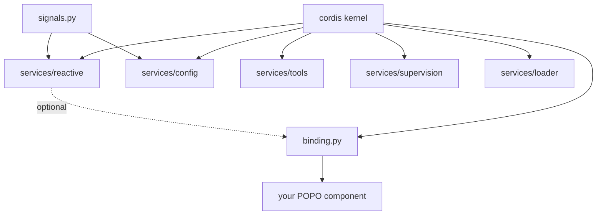
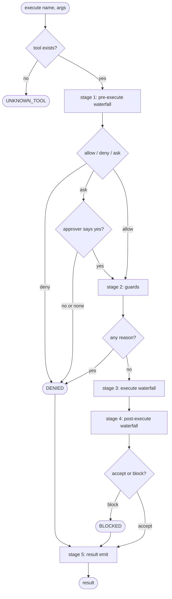

# plugkit — a plugin and dependency-injection kernel

# 1 · Requirements

## Introduction

A Python application whose set of components is not fixed at startup needs four
things: discovery, dispatch, construction, and **lifetime ownership** of what a
component did. Python's ecosystem supplies the first three. This spec covers a
kernel that supplies the fourth without giving up the other three.

## Glossary

- **POPO** — Plain Old Python Object. A class with a normal constructor that
  imports nothing from any framework.
- **Fiber** — the unit of lifetime: one mounted plugin and everything it
  registered. When the fiber unloads, all of it goes together.
- **Effect** — a registration that returns its own undo. The fiber owns the undo.
- **Epoch** — a digest of the identities of the fibers providing a plugin's
  injected services. When it changes, the plugin unloads and re-applies.
- **Waterfall** — a dispatch mode where listeners wrap each other, ending in the
  dispatching service's own default. Middleware, as an event.
- **Carrier** — the `this` of a dispatch. Decides which listeners are called.

## Mental model & invariants

1. The mechanism being provided is not a feature list, it is an **ownership
   model**. If nothing owns the undo of what a component registered, unload is
   never total, and hot reload must be built rather than inherited.
2. **Components must stay POPOs.** Decorators that make a class import the kernel
   are the failure mode, not the feature. The kernel-aware layer is the wiring
   file, not the component.
3. **No tier is privileged.** Config and logging are ordinary plugins. A
   composition may mount none of the shipped services and still be a working
   kernel.
4. Matching Cordis's *semantics* makes DeepSeek Harness's documentation a
   specification for anything built here. Diverging forfeits that.

**Invariants:**

- **I1** A component class imports nothing from the kernel and is constructible
  in a test with no fixtures.
- **I2** Unload is total: every registration a plugin made is gone — listeners,
  services, tools, subscriptions.
- **I3** A plugin does not run until every service it declared is present, and
  stops when one goes away.
- **I4** A listener's parameters are exactly the event arguments, as in Cordis.
- **I5** No tier has privileged status.
- **I6** A guard cannot be overridden. Registration order cannot turn a denial
  back into permission.

## Requirements

### Requirement 1: total unload

**User story:** As a kernel author, I want a plugin's registrations owned by its
lifetime, so unloading leaves nothing behind and hot reload is free.

1. WHEN a plugin's fiber unloads, THE kernel SHALL run every disposer it
   collected, started in reverse registration order.
2. WHEN a plugin registered an event listener and then unloads, THE kernel SHALL
   NOT deliver further events to that listener.
3. WHEN a service a plugin injected becomes unavailable, THE kernel SHALL unload
   that plugin.
4. WHEN a service a plugin injected is replaced by a different providing fiber,
   THE kernel SHALL unload and re-apply that plugin.
5. IF a plugin reads a service it did not inject, THE kernel SHALL refuse.

### Requirement 2: components stay plain objects

**User story:** As a component author, I want to write a normal class, so I can
test it without the kernel and reuse it elsewhere.

1. WHEN a component is bound with `provide()`, THE component class SHALL require
   no import from `plugkit`.
2. WHEN a component declares its dependencies as a Protocol, THE binding SHALL
   derive the runtime injection list from it.
3. WHEN a bound component exposes `close`/`aclose`/`shutdown`/`dispose` or is a
   context manager, THE binding SHALL call it on unload.
4. WHEN a config key a binding reads changes AND `ReactiveService` is mounted,
   THE binding SHALL rebuild the component.
5. IF `ReactiveService` is not mounted, THE binding SHALL still activate and
   SHALL NOT rebuild.

### Requirement 3: a tool registry with a five-stage pipeline

**User story:** As a plugin author, I want to add a rule about everyone's tools
without touching any of them.

1. WHEN a tool is executed, THE registry SHALL run pre-execute, guards, execute,
   post-execute and result, in that order.
2. WHEN a pre-execute listener denies, THE registry SHALL NOT run the tool body.
3. WHEN any guard returns a reason, THE registry SHALL deny regardless of what
   pre-execute returned.
4. WHEN a pre-execute listener asks for approval AND no approver is registered,
   THE registry SHALL deny.
5. WHEN a post-execute listener blocks, THE registry SHALL replace the result
   with that feedback.
6. IF a result listener raises, THE registry SHALL NOT change whether the call
   succeeded.
7. WHEN a tool does not exist or its body raises, THE registry SHALL return a
   structured error rather than raising.
8. THE registry SHALL invoke a tool body at most once per call.

### Requirement 4: conformance, demonstrated

1. WHEN the suite runs, THE project SHALL assert the load-bearing Cordis
   semantics against `vendor/cordis/src/*.ts` behaviour.
2. WHEN a change is taken from upstream, THE conformance suite SHALL be the gate.

### Non-functional

- **NF1** The kernel has no required third-party dependency. `config` needs
  `dependency-injector`, `hmr` needs `watchdog`; both degrade rather than fail.
- **NF2** A plugin author gets editor completion and typo detection on `ctx`
  without a cast.
- **NF3** Every example in the README and the guide is executed by the suite.

## Out of scope

- Auth, credentials, storage, tracing, and transport adapters. Those belong to
  whatever is built on top.
- The remaining 57 DeepSeek Harness service keys. `ctx.tools` proves the shape.

# 2 · Design

## End-to-end walkthrough

An application is a list of plugins. Each says what services it needs; none says
when it should start.

A developer writes `Greeter`, a plain class taking a `database` and a `prefix`.
In `app.py`: `provide(Greeter, "greeter", needs=["database"], config={"prefix": "greeter.prefix"})`.
That returns a plugin — a mapping with a name, an inject list and an apply
function. They hand it and the others to the root context in any order.

The kernel starts nothing immediately. Each plugin waits until the services it
named exist. When the database plugin registers `ctx.database`, the kernel sees
the greeter's dependency set is complete, recomputes its epoch, and runs its
apply. Apply reads `ctx.database`, reads the prefix from config, constructs the
`Greeter`, registers it under `greeter`, and returns a disposer calling
`Greeter.close()`.

Someone changes `greeter.prefix`. A constructor argument cannot be changed after
construction, so a reactive effect the binding registered notices and restarts
the fiber: the old disposer runs, apply runs again, a new `Greeter` is
registered. Every plugin that injected `greeter` sees the provider's identity
change and re-applies in turn.

If the database plugin is disposed, the greeter unloads: listeners removed,
service unregistered, `close()` called. The system is back to the state before
the greeter loaded.

## Architecture



`signals.py` has no edge to the kernel. The dotted edge is the only optional
dependency in the graph.

## The tool pipeline



Stage 5 runs on every outcome including denials: an audit that only sees
successes is not an audit.

```
ALGORITHM execute_tool
  input:  name, arguments, caller
  output: ToolResult  (never raises)
  1. tool ← registry[name];  if absent → failure(UNKNOWN_TOOL)
  2. execution ← frozen(name, arguments, id, caller, tool)
  3. decision ← waterfall("tools/pre-execute", execution, default=allow)
     if ask:  no approver → deny;  else allow iff approver(execution) is True
     if deny → denied(execution, reason)          # stage 5 still runs
  4. for guard in guards:                          # monotonic
        reason ← guard(execution);  if reason → denied(execution, reason)
  5. arity ← signature of tool.execute, resolved once, never by retrying
     result ← waterfall("tools/execute", execution, default=call the body)
  6. post ← waterfall("tools/post-execute", execution, result, default=accept)
     block → failure(BLOCKED);  replacement → result with the new value
  7. emit("tools/result", execution, result)       # listener errors contained
  8. return result
```

## Key decisions

### The dispatch carrier is ambient

Cordis binds the carrier as a listener's `this`, so a listener's parameters are
exactly the event arguments. Python has no `this`, and passing it positionally
would change every listener's arity away from what DeepSeek Harness's plugins
assume. A `ContextVar` (`utils.this_`) keeps arity identical.

### Service names are explicit

`provide()` requires the service name rather than deriving it from the class.
The name is the component's public interface; deriving it would silently rewire
every dependent when a class is renamed, with no error, because a plugin waiting
for an absent service is indistinguishable from one whose turn has not come.

### No platform tier

Config, logging, credentials and storage are ordinary plugins. The kernel's only
built-in service is `ctx.logger`, and it earns that because a fiber must be able
to report its own load failure and cannot inject a service to do so.

### Guards are monotonic

A veto stage may deny, allow or ask. A guard may only deny. If a guard could
allow, registration order would decide the outcome, and order here depends on
when dependencies became available — so a security rule would hold or not hold
depending on how fast a database started.

### A tool body runs at most once

Arity is resolved from the signature, never by calling the body and retrying on
`TypeError`. A body raising its own `TypeError` would otherwise be invoked twice,
after its side effects had already happened.

## Correctness properties

| Property | Statement | Test |
|---|---|---|
| Unload is total | For any plugin P and registration R that P made, when P's fiber unloads, R is gone | `test_unload_is_total`, `test_registration_dies_with_the_plugin` |
| Components are POPOs | For any bound component C, C's module imports nothing from `plugkit` and `C(**kwargs)` succeeds outside any kernel | `test_component_needs_no_kernel_at_all` |
| Guards are monotonic | For any set of guards and any registration order, one denial denies the call | `test_stage2_cannot_be_overridden_by_stage1`, `test_stage2_order_does_not_matter` |
| Observation cannot change outcome | For any stage-5 listener that raises, the returned result is what stage 4 produced | `test_stage5_failure_cannot_change_the_call` |
| A tool body runs once | For any tool whose body raises, the body is invoked exactly once | `test_a_tool_body_never_runs_twice` |

## Edge cases

- A composition with no `ReactiveService`: bindings activate, config changes do
  not rebuild.
- A composition with no `dependency-injector`: `ConfigService` loads dicts and
  YAML; `load_env`/`load_pydantic`/`override` raise a named error.
- A callable stored as component *data* read through the context must not be
  rebound as a method.
- `Ask` with no approver denies.
- A `__slots__` component has no instance `__dict__`; attribute reads pass through.

## Testing strategy

- **Conformance** (`test_conformance.py`): the primary gate. Thirteen assertions
  traced to `vendor/cordis/src/*.ts`, not to this implementation.
- **Vendored suite**: upstream's, kept passing.
- **Per-feature**: one file each, asserting the property that makes the feature
  worth having rather than its API surface.
- **Documentation**: `test_readme_examples.py` and `test_guide_examples.py` run
  every published example.
- **Typing** (`test_typing.py`): pyright over the typed-context patterns; skipped
  when pyright is absent.

# 3 · Tasks

- [x] 1. Kernel: vendor, correct the carrier dispatch, land the conformance suite
- [x] 2. `signals.py` and `ReactiveService`
- [x] 3. `SupervisorService` on the kernel's `FAILED` state
- [x] 4. `ConfigService` with layered loading and per-key signals
- [x] 5. `binding.py` — `provide()`, `@plugin`, Protocol-derived injection
- [x] 6. `ToolsService` — the five stages, `timeout_policy`
- [x] 7. `FileLoader` and `load_app`
- [x] 8. Subscript access on `Context`
- [x] 9. Typed contexts, verified with pyright
- [x] 10. Eight guide chapters, every example executed by the suite

## Log

**2026-08-23** — Shipped. 296 tests. Publishing to PyPI is spec 02.
