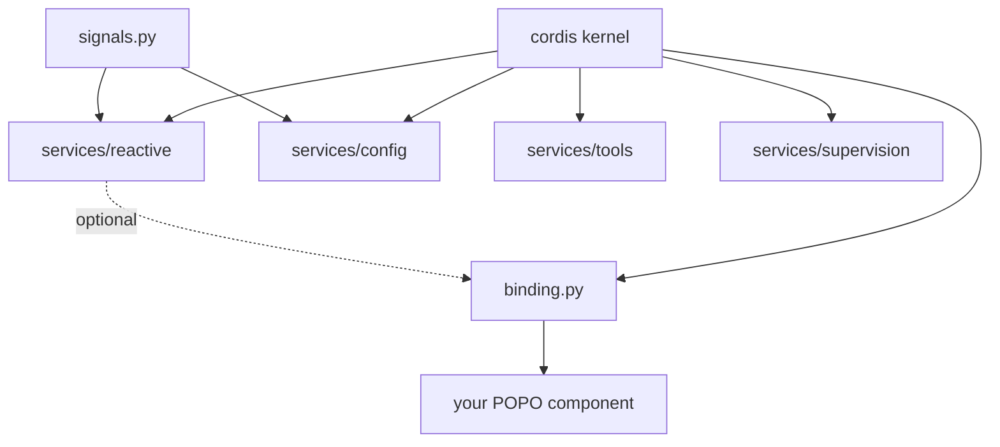
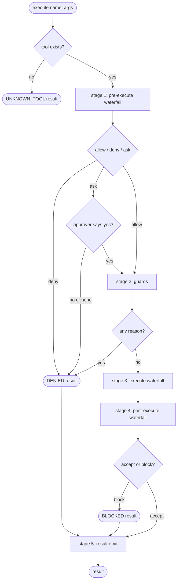
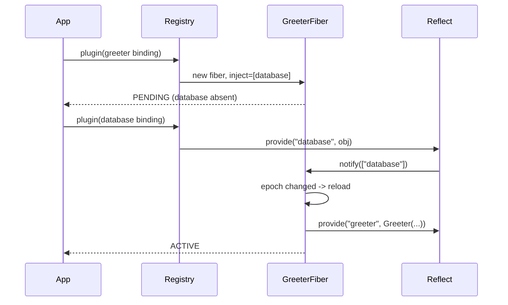
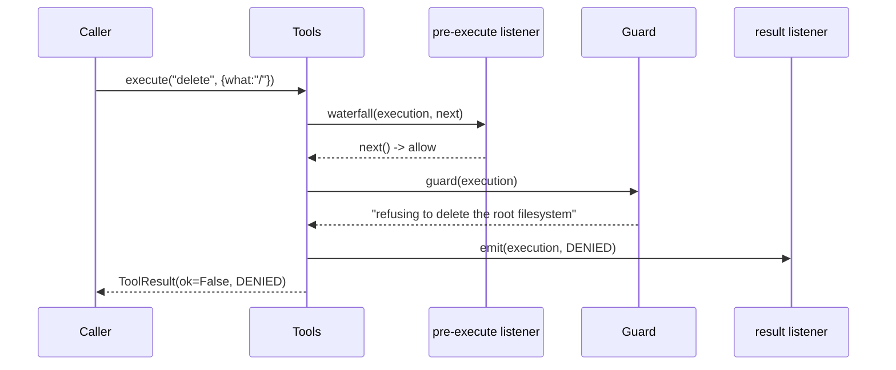

# plugkit — a Cordis-shaped plugin kernel, replacing signalpy

> **This spec was written after its first two commits, not before them.** That is
> a process failure, recorded rather than hidden: `23d1fdb` and `5bf1bbc` landed
> with no spec, no pillar file, and `01-code-review` still ACTIVE. The
> requirements and design below are reconstructed from what was built and what
> was verified; the task list marks what was already done at the time of writing.
> The remaining tasks are genuinely open. See the Log.

# 1 · Requirements

## Introduction

1.0 is a reactive component microkernel. It works, ships as `signalpy-kernel`
0.4.0, and is vendored in prismi3. It also cannot express a plugin system, and
its author finds its own surface confusing. This sprint builds 2.0: the same
problem solved with Cordis's ownership model, keeping the two things 1.0 has that
Cordis does not.

## Glossary

- **POPO** — Plain Old Python Object. A class with a normal constructor that
  imports nothing from any framework.
- **Fiber** — Cordis's unit of lifetime: one mounted plugin and everything it
  registered. When the fiber unloads, all of it goes together.
- **Effect** — a registration that returns its own undo. The fiber owns the undo.
- **Epoch** — a digest of the identities of the fibers providing a plugin's
  injected services. When it changes, the plugin unloads and re-applies.
- **Waterfall** — a dispatch mode where listeners wrap each other, ending in the
  dispatching service's own default. Express middleware, as an event.
- **Carrier** — the `this` of a dispatch. Decides which listeners are called.
- **dsh** — DeepSeek Harness, the agent runtime Cordis was built for.

## Mental Model & Invariants

**Model** — in the owner's terms:

1. 1.0 is *declarative*: a class wears decorators, the kernel reads them up front
   and wires everything. 2.0 is *imperative*: a plugin runs and registers things,
   and every registration hands back its undo.
2. The thing being replaced is not a feature list, it is an **ownership model**.
   Nothing in 1.0 owns the undo of what a component registered, so unload is never
   total, so hot reload has to be built instead of inherited.
3. **Components must stay POPOs.** Decorators that make a class import the kernel
   are the failure mode, not the feature. The kernel-aware layer is the wiring
   file, not the component.
4. **Config and logging were never system services.** 1.0 called them platform;
   they are ordinary plugins and should have no privileged tier.
5. Matching Cordis's *semantics* is what turns dsh's 457k lines of TypeScript into
   a readable specification. Diverging from them forfeits that.

**Invariants** any solution must hold:

- **I1** A component class imports nothing from the kernel and is constructible
  in a test with no fixtures.
- **I2** Unload is total: when a plugin's fiber unloads, every registration it
  made is gone — listeners, services, tools, subscriptions.
- **I3** A plugin does not run until every service it declared is present, and
  stops when one goes away.
- **I4** A listener's parameters are exactly the event arguments, as in Cordis.
- **I5** No tier has privileged status. The kernel is the plugin machinery; every
  capability above it is a plugin that can be left unmounted.
- **I6** A guard cannot be overridden. Registration order cannot turn a denial
  back into permission.

## Decisions & Corrections (log)

- **2026-08-23** — Vendor a port rather than write one. Three MIT Python ports of
  Cordis exist; the question is which, not whether.
- **2026-08-23** — Owner correction: the annotation approach is rejected. Kernel
  decorators on a component make it stop being a POPO. Scope change — `provide()`
  and `@plugin` are the answer, not `@component`/`@provides`/`@requires`.
- **2026-08-23** — Owner correction: config and logging are common services, not
  system services. Scope change — delete the platform tier, move everything into
  `services/`.
- **2026-08-23** — Correction to a claim made in this project: "typed `ctx` has no
  Python equivalent" was wrong. Verified with pyright — annotating the plugin's own
  parameter with a Protocol typechecks fully.

## Dev Environment (config-as-code — pointers only)

- Python + deps: `pyproject.toml` + `uv`
- Test: `uv run pytest src/plugkit/tests -q` (`asyncio_mode`/`pythonpath` in `pyproject.toml`)
- Optional extras: `config` (dependency-injector), `hmr` (watchdog), pyright for `test_typing.py`
- Vendored fork provenance and patch list: `src/plugkit/VENDORED.md`

## Requirements

### Requirement 1: A plugin kernel with total unload

**User Story:** As a kernel author, I want a plugin's registrations to be owned by
its lifetime, so that unloading it leaves nothing behind and hot reload is free.

#### Acceptance Criteria
1. WHEN a plugin's fiber unloads, THE kernel SHALL run every disposer it collected, in reverse order.
2. WHEN a plugin registered an event listener and then unloads, THE kernel SHALL NOT deliver further events to that listener.
3. WHEN a service a plugin injected becomes unavailable, THE kernel SHALL unload that plugin.
4. WHEN a service a plugin injected is replaced by a different providing fiber, THE kernel SHALL unload and re-apply that plugin.
5. IF a plugin declares a service it did not inject, THE kernel SHALL refuse the read.

### Requirement 2: Components stay plain objects

**User Story:** As a component author, I want to write a normal class, so that I
can test it without the kernel and reuse it outside this framework.

#### Acceptance Criteria
1. WHEN a component is bound with `provide()`, THE component class SHALL require no import from `plugkit`.
2. WHEN a component declares its dependencies as a Protocol, THE binding SHALL derive the runtime injection list from it.
3. WHEN a bound component exposes `close`/`aclose`/`shutdown`/`dispose` or is a context manager, THE binding SHALL call it on unload.
4. WHEN a config key a binding reads changes AND `ReactiveService` is mounted, THE binding SHALL rebuild the component.
5. IF `ReactiveService` is not mounted, THE binding SHALL still activate and SHALL NOT rebuild on config change.

### Requirement 3: A tool registry with a five-stage pipeline

**User Story:** As a plugin author, I want to add a rule about everyone's tools
without touching any of them, so that policy is composable.

#### Acceptance Criteria
1. WHEN a tool is executed, THE registry SHALL run pre-execute, guards, execute, post-execute, and result, in that order.
2. WHEN a pre-execute listener returns a denial, THE registry SHALL NOT run the tool body.
3. WHEN any guard returns a reason, THE registry SHALL deny the call regardless of what pre-execute returned.
4. WHEN a pre-execute listener asks for approval AND no approver is registered, THE registry SHALL deny.
5. WHEN a post-execute listener blocks, THE registry SHALL replace the result with that feedback.
6. IF a result listener raises, THE registry SHALL NOT change whether the call succeeded.
7. WHEN a tool does not exist or its body raises, THE registry SHALL return a structured error rather than raising.

### Requirement 4: Conformance to Cordis, demonstrated

**User Story:** As a maintainer, I want the claim "this is Cordis" to be a test,
so that dsh's documentation stays a valid specification.

#### Acceptance Criteria
1. WHEN the suite runs, THE project SHALL assert the load-bearing Cordis semantics against `vendor/cordis/src/*.ts` behaviour.
2. WHEN a vendored change is taken from upstream, THE conformance suite SHALL be the gate that says whether the port still holds.

### Non-Functional

- **NF1** The kernel has no required third-party dependency. `config` needs `dependency-injector`, `hmr` needs `watchdog`; both degrade rather than fail.
- **NF2** 1.0 (`src/signalpy`) keeps working unchanged — prismi3 vendors it.
- **NF3** A plugin author gets editor completion and typo detection on `ctx` without a cast.

## Out of Scope

- Migrating prismi3 to 2.0. 2.0 does not supersede 1.0 until something moves.
- The remaining 57 dsh service keys. `ctx.tools` is the one that proves the shape.
- A compatibility veneer letting 1.0 decorators run on the 2.0 kernel.

# 2 · Design

## End-to-End Walkthrough

An application is a list of plugins. Each plugin says what services it needs; none
says when it should start.

A developer writes `Greeter`, a plain class taking a `database` and a `prefix`. In
`app.py` they write one line: `provide(Greeter, needs=["database"], config={"prefix": "greeter.prefix"})`.
That returns a plugin — a mapping with a name, an inject list, and an apply
function. They hand it and the others to the root context in any order.

The kernel starts nothing immediately. Each plugin waits until the services it
named exist. When the database plugin registers `ctx.database`, the kernel notices
that the greeter's dependency set is now complete, recomputes its epoch, and runs
its apply. Apply reads `ctx.database`, reads the prefix from config, constructs
`Greeter(database=..., prefix=...)`, registers it under `greeter`, and returns a
disposer that calls `Greeter.close()`.

Now someone changes `greeter.prefix`. A constructor argument cannot be changed
after construction, so the honest response is a new object: a reactive effect the
binding registered notices the key moved and restarts the fiber. The old disposer
runs — `close()` is called — apply runs again, and a new `Greeter` is registered.
Every plugin that injected `greeter` sees the provider's identity change, and
each unloads and re-applies in turn. Nothing was written by hand to make that
happen.

If the database plugin is disposed, the greeter unloads: its listeners are
removed, its service is unregistered, `close()` is called. The system is back to
the state it was in before the greeter ever loaded. That is what "unload is total"
buys, and it is why hot reload needs no separate mechanism.

## Tech Stack

- **Language**: Python 3.13+ (`typing.get_protocol_members`)
- **Kernel**: vendored port of Cordis 4 — see `VENDORED.md`
- **Config loading**: `dependency-injector` `providers.Configuration` (optional)
- **Testing**: pytest + pytest-asyncio (`asyncio_mode = auto`); pyright for the typing tests

## Directory Structure

```
src/plugkit/
  cordis/           the vendored kernel — context, fiber, effects, events, registry, loader, hmr
  binding.py        provide() and @plugin — how a POPO becomes a service
  signals.py        Signal / Computed / Effect — a plain library, no kernel import
  services/         ordinary plugins with no privileged status
    config.py         ctx.config    — dependency-injector loading, per-key Signals
    reactive.py       ctx.reactive  — Signals bound to fiber lifetime
    supervision.py    ctx.supervisor— restart strategies on FAILED fibers
    tools.py          ctx.tools     — the five-stage pipeline
  examples/         typed_plugin.py — the typed-ctx pattern
  tests/            vendored suite + conformance + one file per graft
```

## Architecture Overview



`signals.py` has no edge to the kernel — it is a standalone library. The dotted
edge is the only optional dependency in the graph: a binding uses `ctx.reactive`
if it is mounted and works without it.

## Workflow — a tool call through the five stages



Stage 5 runs on every outcome including denials — an audit that only sees
successes is not an audit.

## Module Design

### `binding.provide`
- **Purpose**: turn a plain class into a plugin registering one service.
- **Interface**: `provide(factory, *, as_=None, needs=None, config=None, close=None, name=None, extra=None) -> dict`
- **Dependencies**: the kernel's `ctx.provide` / `ctx.effect` / `ctx.inject`.

### `binding.plugin`
- **Purpose**: mark a function as a plugin, typeably. Cordis's `fn.inject = [...]` does not typecheck.
- **Interface**: `plugin(fn=None, *, inject=None, name=None) -> dict`
- **Dependencies**: `typing.get_protocol_members`, `CONTEXT_MEMBERS`.

### `services.tools.ToolsService`
- **Purpose**: `ctx.tools` — registry plus the five-stage pipeline.
- **Interface**: `register(tool)`, `guard(fn)`, `set_approver(fn)`, `get`, `list`, `names`, `async execute(name, arguments, *, caller, id)`
- **Dependencies**: the kernel's waterfall dispatch.

## Key Algorithms (pseudo-code)

```
ALGORITHM execute_tool
  input:  name, arguments, caller
  output: ToolResult  (never raises)
  1. tool ← registry[name];  if absent → return failure(UNKNOWN_TOOL)
  2. execution ← frozen(name, arguments, id, caller, tool)
  3. decision ← waterfall("tools/pre-execute", execution, default=allow)
     if decision is ask:
        if no approver → decision ← deny(reason)          # fails closed
        else decision ← allow if approver(execution) is True else deny
     if decision is deny → return denied(execution, reason)   # stage 5 still runs
  4. for guard in guards:                                  # monotonic
        reason ← guard(execution)
        if reason → return denied(execution, reason)
  5. result ← waterfall("tools/execute", execution, default=run_tool_body)
     on exception → failure(TOOL_ERROR); on cancel → failure(ABORTED)
  6. post ← waterfall("tools/post-execute", execution, result, default=accept)
     if post is block   → result ← failure(BLOCKED, post.feedback)
     if post replaces   → result ← result with post.value
  7. emit("tools/result", execution, result)               # errors contained
  8. return result
```

```
ALGORITHM rebuild_on_config_change        # binding.py, the optional watch
  1. owner ← the binding's own fiber
  2. mount a child plugin injecting ["reactive", "config"]
        # a child, not the binding's own inject, so a composition without
        # ReactiveService still activates the binding
  3. inside it, register a reactive effect that reads every config key
     the binding uses:
        first run  → record the values, do nothing
        later run  → if any value differs → owner.restart()
                        (old disposers run → close() → apply() → new object)
```

## Sequence Diagrams

Activation when a dependency appears:



A denied tool call:



## Error Handling Strategy

- The tool pipeline never raises: every failure is a `ToolResult` with a code
  (`UNKNOWN_TOOL`, `DENIED`, `BLOCKED`, `TOOL_ERROR`, `TOOL_TIMEOUT`, `ABORTED`).
- A stage-5 listener that raises is logged and contained (Req 3.6).
- A guard or approver that raises becomes a denial, never an allow — failing
  closed is the only safe direction for a permission check.
- `await ctx.plugin(p)` rethrows a plugin's startup error, matching Cordis. A
  failing mount is observed through fiber state, not by awaiting it.

## Testing Strategy

- **Conformance** (`test_conformance.py`): the primary gate. Nine assertions
  traced to `vendor/cordis/src/*.ts`, not to this implementation. Run first when
  taking any upstream change.
- **Vendored suite**: upstream's 156 + 2 xfail, kept passing.
- **Per-feature**: one file per graft, each asserting the *property that makes the
  graft worth having*, not its API surface.
- **Typing** (`test_typing.py`): runs pyright over snippets; skipped when absent.
- **Test command**: `uv run pytest src/plugkit/tests -q`

## Correctness Properties

### Property 1: Unload is total
- **Statement**: *For any* plugin P and any registration R that P made, when P's fiber unloads, R is gone.
- **Validates**: Req 1.1, 1.2 · **Test**: `test_unload_is_total`, `test_registration_dies_with_the_plugin`, `test_subscription_dies_with_the_plugin_that_made_it`

### Property 2: A component is a POPO
- **Statement**: *For any* bound component C, C's module imports nothing from `plugkit` and `C(**kwargs)` succeeds outside any kernel.
- **Validates**: Req 2.1 · **Test**: `test_component_needs_no_kernel_at_all`

### Property 3: Guards are monotonic
- **Statement**: *For any* set of guards and any registration order, if one guard denies, the call is denied.
- **Validates**: Req 3.3 · **Test**: `test_stage2_cannot_be_overridden_by_stage1`, `test_stage2_order_does_not_matter`

### Property 4: Observation cannot change outcome
- **Statement**: *For any* stage-5 listener that raises, the returned result is what stage 4 produced.
- **Validates**: Req 3.6 · **Test**: `test_stage5_failure_cannot_change_the_call`

## Edge Cases

- A composition with no `ReactiveService`: bindings activate, config changes do not rebuild.
- A composition with no `dependency-injector`: `ConfigService` loads dicts and YAML; `load_env`/`load_pydantic`/`override` raise a named error.
- A callable stored as component *data* (a provider, a lambda, a partial) read through the context — must not be rebound as a method. Two bugs found here; see Decisions.
- `Ask` with no approver — denies.
- A `__slots__` component — no instance `__dict__`; attribute reads pass through.

## Decisions

### Decision: Vendor geohotstan's port rather than write one
**Context:** Three MIT Python ports of Cordis exist; all pass their own suites.
**Options:** (1) write from scratch — full control, 2,700 LOC of subtle lifecycle logic re-derived; (2) vendor the closest — inherits its bugs; (3) depend on one — a 0-star pre-1.0 package under a product.
**Decision:** Vendor, as a fork, with a conformance suite as the gate.
**Rationale:** A suite written against Cordis's documented semantics scored the three at 6/9, 5/9, and n/a. ge3m0r's `ctx.effect()` raises `'Symbol' object is not callable` — the central API does not work, and its 59 tests never touch it. ddebowczyk's re-designed the API around typed tokens, which forfeits the reason to port Cordis. geohotstan's three failures were one divergence.

### Decision: the dispatch carrier is ambient, not positional
**Context:** Cordis binds the carrier as `this`. The vendored port passed it as a leading positional to every listener.
**Decision:** A `ContextVar` (`utils.this_`), so listener arity matches Cordis.
**Rationale:** `ctx.on('tools/pre-execute', cb)` from dsh's documentation must work unmodified. An arity divergence silently breaks every ported plugin.
**Consequences:** `this_()` is valid during a listener's synchronous body and across an async listener's own awaits, not in a coroutine awaited elsewhere.

### Decision: no platform tier
**Context:** 1.0 had "Axis 2 — platform components": config, logging, credentials, storage, auth, workspace, tracing.
**Decision:** Delete the tier. `plugkit/services/` holds ordinary plugins.
**Rationale:** Owner correction — these are common services, not system services. Cordis agrees: dsh's `ctx.settings`, `ctx.credentials`, `ctx.storage` are seams, not core. The kernel's only built-in service is `ctx.logger`, because the fiber must report its own load failures.

### Decision: components are POPOs; the wiring layer is kernel-aware
**Context:** 1.0's decorators made every component import the kernel.
**Decision:** `provide()` splits the component from its registration.
**Rationale:** Owner correction. A component that imports the kernel cannot be tested without it or reused outside it.
**Consequences:** One extra line per component, in one file. `@plugin` still exists for genuinely kernel-aware plugins — that layer is *supposed* to know about `ctx`.

# 3 · Tasks

## Status marks
<!-- [ ] pending | [x] done | [!] BLOCKED: reason | [-] DROPPED: reason | [>] → spec_id -->

## Tasks

- [x] 1. Kernel foundation
  - [x] 1.1 Evaluate the three public Cordis ports against a conformance suite
    - Wrote 9 checks against `vendor/cordis/src/*.ts`; ran all three; scored 6/9, 5/9, n/a
    - **Requirements**: 4.1 · **Properties**: 1
  - [x] 1.2 Vendor geohotstan's port; record provenance and patch list
    - `src/plugkit/cordis/`, `VENDORED.md` · **Depends**: 1.1
  - [x] 1.3 Fix the carrier divergence — ambient `this_()` across five dispatch modes
    - **Depends**: 1.2 · **Requirements**: 1.4 (I4)
  - [x] 1.4 Land `test_conformance.py` as the upstream-change gate
    - 9/9 · **Depends**: 1.3 · **Requirements**: 4.1, 4.2

- [x] 2. The two grafts Cordis lacks
  - [x] 2.1 `ReactiveService` — Signals owned by fiber lifetime
    - **Requirements**: 1.1 · **Properties**: 1
  - [x] 2.2 `SupervisorService` — restart strategies on the unused FAILED state
  - [x] 2.3 `ConfigService` — dependency-injector loading, one Signal per dotted key
    - **Requirements**: NF1

- [x] 3. POPO bindings
  - [x] 3.1 `provide()` — needs / config / close, Protocol-derived injection
    - **Requirements**: 2.1, 2.2, 2.3 · **Properties**: 2
  - [x] 3.2 Rebuild-on-config-change via `ctx.inject`, degrading without reactive
    - **Depends**: 3.1 · **Requirements**: 2.4, 2.5
  - [x] 3.3 `@plugin` decorator — typeable, derives inject from the annotation
    - **Depends**: 3.1 · **Requirements**: NF3

- [x] 4. `ctx.tools`
  - [x] 4.1 Registry with fiber-owned registration and duck-typed tools
    - **Requirements**: 3.7 · **Properties**: 1
  - [x] 4.2 The five stages, with Ask failing closed
    - **Depends**: 4.1 · **Requirements**: 3.1, 3.2, 3.4, 3.5 · **Properties**: 3, 4
  - [x] 4.3 `timeout_policy` as the reference stage-3 plugin
    - **Depends**: 4.2

- [x] 5. Tier cleanup
  - [x] 5.1 Delete the platform tier; move config/reactive/supervision/tools to `services/`
    - **Requirements**: I5
  - [x] 5.2 `signals.py` as a standalone library with no kernel import

- [x] 6. Typing
  - [x] 6.1 Verify the typed-ctx approaches with pyright; correct the earlier claim
    - **Requirements**: NF3
  - [x] 6.2 `examples/typed_plugin.py` + `tests/test_typing.py` (skips without pyright)
    - **Depends**: 6.1

- [x] 7. Process debt this sprint created
  - [x] 7.1 Write this spec, marked as written after the fact
  - [x] 7.2 Create `docs/steering/pillars.md`
  - [x] 7.3 Close `01-code-review` (RETRACTED) and migrate `02` to the current schema
  - [x] 7.4 Move the 11 legacy flat spec files to `docs/history/2026-04-design-notes/`

- [x] 8. Review and teaching
  - [x] 8.1 Run the S1–S12 / Q1–Q7 review over `src/plugkit`; fix what it finds
    - Three defects found and fixed, each with a regression test in `test_review_regressions.py`
    - **Depends**: 7.1
  - [x] 8.2 Write `docs/design/kernel-architecture.md` — the anchor this spec names
    - **Depends**: 8.1
  - [x] 8.3 Teach plugkit in the Quarto book: the model, plugins, POPO bindings, tools
    - Four chapters; the 1.0 book preserved at `docs/history/2026-08-v1-book/`
    - **Depends**: 8.2 · **Pillar**: Teaching 🔴 → 🟡

- [x] 9. Retire signalpy and rename
  - [x] 9.1 Check whether v1 has users — 0 stars / forks / watchers / issues after 4 months
  - [x] 9.2 Delete `src/signalpy/`; 0.4.0 stays on PyPI for prismi3
    - **Depends**: 9.1
  - [x] 9.3 Rename the package to `plugkit`; rewrite README, index, and the book
    - `signalpy` named Signals, which are now one optional plugin — the name
      described the smallest part of the system
    - **Depends**: 9.2
  - [x] 9.4 Demonstrate that construction policy is a plugin, not the kernel
    - `examples/alternative_binding.py` — a factory-per-call policy needing no kernel change

## Notes

**Pillar balance for this sprint:** Kernel ✓, Adoptability ✓, Conformance ✓,
Packaging ✓ (partial), Teaching ✗ through tasks 1–7 — exactly the imbalance
`pillars.md` exists to surface — then corrected in 8.3.

**Left for a successor sprint:** publishing to PyPI, and reconstructing the
patterns and reference sections of the book. Neither is started, so neither is
marked here; they belong to `04-*` when it opens.

## Log

**2026-08-23** — Commits `23d1fdb`, `5bf1bbc`, `58f318a` landed before this spec
existed. Written retroactively; tasks 1–7 marked done from the code and tests that
prove them, task 8 genuinely open. Two owner corrections mid-sprint (POPO
components; no system-services tier) changed the design and are recorded in
Decisions rather than folded in silently.

Two bugs found in the vendored port while building on it, both the same class:
`Traceable.__getattr__` rebound any callable attribute as a method on the
traceable view. The first fix used `inspect.getattr_static`, which still could not
tell a lambda stored as instance data from a method; the discriminator is whether
the name lives in the instance `__dict__`.

One claim made earlier in this project was wrong and is corrected in Decisions:
typed `ctx` is achievable in Python, verified with pyright.
