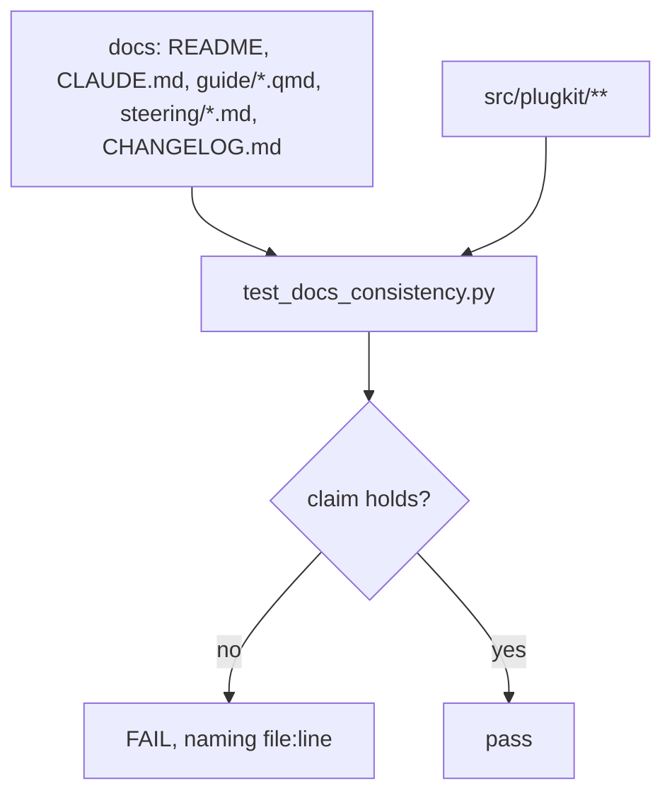
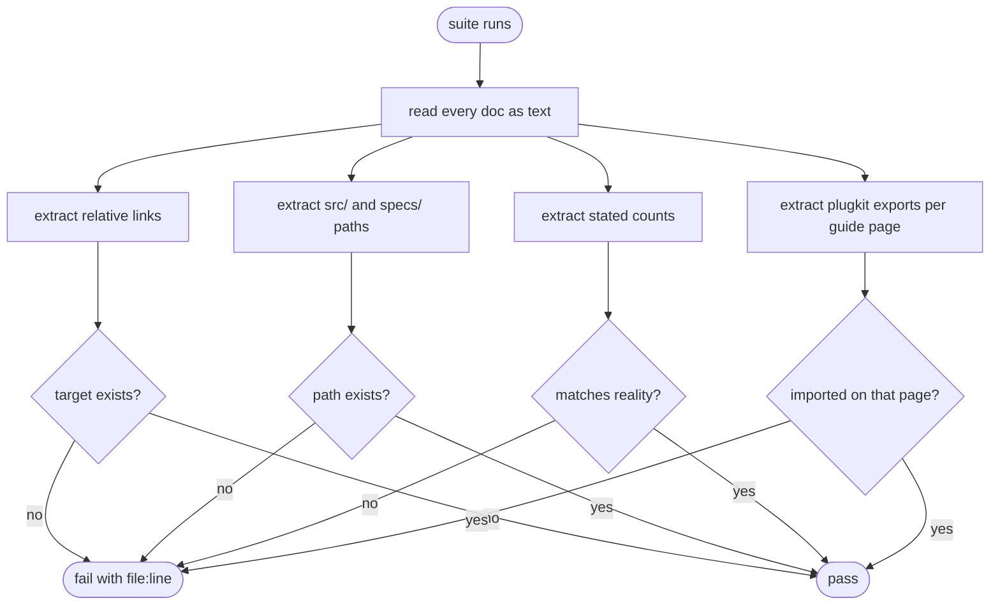
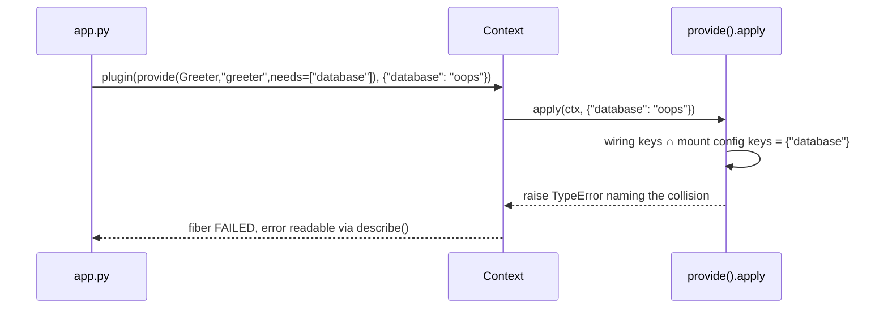

# The docs are checked against the code

# 1 · Requirements

## Introduction

Specs 01–04 shipped a kernel, a package, extension points and introspection. A
reading of the published docs against the code on 2026-08-23 and 2026-08-24 found
fifteen places where the two disagree: three are wrong code, eleven are wrong
prose, and one is the reason the eleven survived.

The eleven are not eleven mistakes. They are one mistake made eleven times: a
claim written into prose, true when written, with nothing that fails when it stops
being true. The conformance-assertion count is stated in five files and is wrong
in five files.

This spec fixes the fifteen and adds the check that fails on the sixteenth.

## Glossary

- **Claim** — a sentence in a doc that asserts something checkable about the code:
  a count, a path, a symbol name, a method list, a link target.
- **Grounded claim** — a claim some test would fail on if the code changed
  underneath it.
- **Snippet completeness** — whether a code block, copied out of the page as
  printed, runs. A block using `Deny` with no `from plugkit import Deny` above it
  is incomplete even though the API is real.

## Mental model & invariants

1. **A number in prose is a bug waiting to happen.** Either a test asserts it or
   it does not belong in prose. `test_readme_examples.py` already applies this
   reasoning to code; it was never applied to counts, paths or symbol lists.
2. **Running an example is not the same as publishing a runnable example.**
   `test_guide_examples.py` re-types each example into a module that imports what
   it needs at the top. It proves the API works. It cannot prove the page is
   complete, and chapter 3 is not.
3. **Refusing beats guessing.** Where the code currently does something surprising
   and silent — substituting a literal for an injected service, exiting a context
   manager nobody entered — the fix is to refuse, not to pick a better default.
   The same reasoning that makes `provide()` demand a service name and a guard
   have no allow.

**Invariants:**

- **I1** Every count stated in a doc is asserted by the suite, or is not stated.
- **I2** Every `plugkit` export named in a guide code block is imported in a code
  block on the same page.
- **I3** Every relative link in a doc resolves to a file that exists.
- **I4** Every repository path named in a doc exists.
- **I5** A binding never silently substitutes a literal for an injected service.
- **I6** A component is never torn down through a protocol it was not set up
  through.

## Decisions & Corrections (log)

**2026-08-24** — Scope confirmed as audit-and-fix plus the check that keeps it
fixed. Not in scope: publishing to PyPI (LO decides when, see
`docs/history/2026-08-23-publishing-handoff.md`), and the tests-in-the-wheel
decision recorded there.

**2026-08-24** — A supervision guide chapter is real teaching debt found by this
audit but is authoring work, not a consistency fix. Deferred to `06-guide-gaps`
rather than dropped.

## Dev Environment

- Python/deps: `pyproject.toml` + `uv`
- Gate: see `CLAUDE.md` § Commands — corrected by task 3.1 of this spec
- Test config (`asyncio_mode`, `pythonpath`): `pyproject.toml`

## Requirements

### Requirement 1: the code does what the docs say

**User story:** As a reader, I want the behaviour I was promised, so that a
documented API does not surprise me at runtime.

1. WHEN two contributions share a key in one point, THE `points.get()` lookup
   SHALL return the most recently added, matching `points.last()`, regardless of
   their `order` values.
2. WHEN a mount config key collides with a name in the binding's `needs`, THE
   binding SHALL raise rather than replace the injected service with the literal.
3. WHEN a bound component's only teardown is the context-manager protocol, THE
   binding SHALL enter it at construction and register what `__enter__` returned.
4. IF a component's only teardown is the *asynchronous* context-manager protocol,
   THE binding SHALL raise at construction naming `close=` as the way to say what
   to call, rather than exiting a context nobody entered.

### Requirement 2: no ungrounded claim survives a change

**User story:** As a maintainer, I want a doc claim to fail the suite when it stops
being true, so that prose cannot rot quietly between releases.

1. WHEN the suite runs, THE project SHALL assert every conformance-assertion count
   stated in a doc against the number of tests in `test_conformance.py`.
2. WHEN the suite runs, THE project SHALL assert every relative link in a doc
   resolves.
3. WHEN the suite runs, THE project SHALL assert every repository path named in a
   doc exists.
4. WHEN a guide code block names a `plugkit` export, THE suite SHALL assert that
   page imports it in a code block.
5. IF a doc states a total test count, THE suite SHALL fail — a number that
   changes on every added test does not belong in prose.

### Requirement 3: the documented gate is the gate

1. WHEN a reader runs the command `CLAUDE.md` gives for the test suite, THE suite
   SHALL pass.

### Non-functional

- **NF1** The consistency check adds no third-party dependency and no new test
  framework. It is one file in the existing suite.
- **NF2** The check reads the docs as text. It does not import them, execute
  fenced blocks, or require Quarto.

## Out of scope

- **Publishing.** No tag, no upload, no `workflow_dispatch`. LO decides.
- **A supervision guide chapter.** Deferred to `06-guide-gaps`.
- **Executing fenced code blocks as programs.** Most fences are fragments. The
  check is static: does the page import what it names. `test_guide_examples.py`
  keeps proving the API works.

# 2 · Design

## End-to-end walkthrough

A maintainer changes something in the kernel — adds a conformance assertion,
renames a module, drops a method from `binding.py`. They run the suite.

Today: green. The README still says thirteen assertions, still points at the old
path, still lists the old method. Nothing noticed. The reader finds out.

After this spec: `test_docs_consistency.py` fails, naming the file and line of the
prose that is now false. The maintainer edits the sentence in the same commit that
changed the code, because the suite will not go green until they do.

The three code fixes are separate and smaller. Each is a case where the code was
quietly doing something other than what the page said, and each is fixed by
refusing rather than by choosing a better silent default.

## Architecture



The check has no runtime role. It imports nothing from the docs and the docs
import nothing from it; it reads both sides as data.

## Workflow



## Key algorithms

```
ALGORITHM check_stated_counts
  input:  doc files, test_conformance.py
  output: failures
  1. actual ← count of `def test_*` in test_conformance.py
  2. for each doc, for each line:
       if line matches a conformance-count phrase (word or digit form):
          stated ← parse the number
          if stated ≠ actual → failure(file, line, stated, actual)
  3. for each doc, for each line:
       if line states a whole-suite pass count ("NNN passed", "NNN tests"):
          failure(file, line, "a total test count must not appear in prose")
  4. return failures
```

```
ALGORITHM check_snippet_completeness
  input:  a guide page, plugkit.__all__
  output: failures
  1. blocks ← fenced python blocks on the page
  2. imported ← every name in a `from plugkit... import ...` in any block
  3. for each block, for each token:
       if token in __all__ and token not in imported
          and token is used as a value (called, mounted, or attribute base):
            failure(page, token)
  4. return failures
```

Step 3's qualifier matters. `plugin` is both an export and an ordinary variable
name, and `ctx.plugin(...)` is a context method, so a bare token match reports
noise. The check counts a use only where the token is the head of a call or is
passed to `root.plugin(...)`.

## Sequence diagram — the binding refusing a collision



## Module design

### `src/plugkit/tests/test_docs_consistency.py` (new)

- **Purpose:** fail when a doc claim stops being true.
- **Interface:** ordinary pytest functions, one per claim class.
- **Dependencies:** `pathlib`, `re`, `ast`. Nothing else.

### `src/plugkit/services/points.py` (change)

`get()` resolves by registration sequence, not by sort position.

### `src/plugkit/binding.py` (change)

`apply()` rejects a mount-config key that collides with `needs`.
`_find_closer()` enters a sync context manager and refuses an async-only one.

## Data models

The snapshot shape is unchanged. `Contribution` is unchanged.

## Error handling strategy

Both new refusals raise `TypeError` at apply time, so the fiber lands in `FAILED`
with the reason readable through `describe()` — the path spec 04 built for exactly
this.

## Testing strategy

- **Property tests** — one per invariant I1–I6.
- **Regression tests** — one per code bug, each written to fail against the code
  as it is today. The `points.get()` test uses differing `order` values, which is
  the case every existing test missed.
- **Test command:** `uv run pytest src/plugkit/tests -q`
- **Lint command:** `uv run --with pyright pytest src/plugkit/tests/test_typing.py`

## Correctness properties

| Property | Statement | Test |
|---|---|---|
| Key lookup is arrival-ordered | For any two contributions sharing a key, with any `order` values, `get()` returns the same one `last()` would | `test_get_resolves_by_arrival_not_by_order` |
| A binding never shadows a service | For any binding with `needs=[n]` and any mount config containing `n`, apply raises | `test_mount_config_cannot_shadow_an_injected_service` |
| Teardown matches setup | For any component whose only teardown is `__exit__`, `__enter__` ran first | `test_a_context_manager_component_is_entered` |
| Claims are grounded | For any doc claim of a checkable kind, changing the code fails the suite | `test_docs_consistency.py` |

## Edge cases

- A component with both `close()` and `__exit__`: `close()` still wins. Unchanged.
- A mount config key colliding with a `config=` key or an `extra=` key: still
  allowed, still overrides. That is the feature; only `needs` is protected.
- A doc line that mentions a number inside a code fence showing example *output*:
  excluded, or the check would fail on its own illustrations.
- A guide page that names an export only in prose, never in a code block: not a
  snippet-completeness failure.

## Decisions

### Decision: refuse a `needs` collision rather than define a precedence

**Context:** `kwargs.update(plugin_config)` lets a mount config replace anything,
including a live service object with a string literal.
**Options:**
1. Document the precedence as intended — cheapest, leaves a silent foot-gun.
2. Make `needs` win over the mount config — silently ignores what the caller
   passed, which is a different silent surprise.
3. Raise on the collision.
**Decision:** 3.
**Rationale:** The two silent options each pick a winner and hide the conflict. A
mount config that names an injected service is a mistake in the composition, not a
preference — the caller cannot mean "use this string as the database" while also
declaring `needs=["database"]`, because the binding still reloads when the real
service is replaced. Refusing says so at the moment the composition is written.

### Decision: enter sync context managers, refuse async-only ones

**Context:** `_find_closer` returns `__exit__` for any object with one, entered or
not.
**Options:**
1. Stop advertising context-manager support and delete the branch.
2. Enter at construction; for async-only, make `apply` async.
3. Enter at construction; for async-only, raise and name `close=`.
**Decision:** 3.
**Rationale:** 1 removes a working, advertised feature for the common sync case.
2 makes every binding's apply a coroutine, adding a scheduling tick before the
service is registered and changing the `await root.plugin(p)` timing every doc and
test depends on — a large behaviour change to serve a case with no known user. 3
fixes the real bug, keeps the timing, and tells an async-CM author the one-word
answer.

### Decision: check counts statically rather than removing them

**Context:** Five files state the conformance-assertion count; all five are wrong.
**Options:**
1. Delete every number from prose.
2. Assert each stated number against reality.
**Decision:** 2 for the conformance count, 1 for the whole-suite test count.
**Rationale:** The conformance count is load-bearing — it is the project's central
claim and it changes rarely, so stating it is worth the check. The total test count
changes on every commit and carries no information a reader needs; asserting it
would make every new test a docs edit. Requirement 2.5 makes stating it a failure.

## Retirement of superseded features

None. This spec supersedes nothing.

# 3 · Tasks

## Status marks
<!-- [ ] pending | [x] done | [!] BLOCKED: reason | [-] DROPPED: <reason> | [>] → <spec_id> -->

## Tasks

- [x] 1. Code fixes
  - [x] 1.1 `points.get()` resolves by arrival, not sort position
    - **Depends**: —
    - **Requirements**: 1.1
    - **Properties**: Key lookup is arrival-ordered
    - **Pillar**: Kernel
  - [x] 1.2 `provide()` refuses a mount-config key colliding with `needs`
    - **Depends**: —
    - **Requirements**: 1.2
    - **Properties**: A binding never shadows a service
    - **Pillar**: Kernel, Adoptability
  - [x] 1.3 `_find_closer` enters a sync context manager; refuses an async-only one
    - **Depends**: —
    - **Requirements**: 1.3, 1.4
    - **Properties**: Teardown matches setup
    - **Pillar**: Kernel

- [x] 2. The check
  - [x] 2.1 `test_docs_consistency.py` — links, paths, counts, snippet completeness
    - **Depends**: —
    - **Requirements**: 2.1, 2.2, 2.3, 2.4, 2.5
    - **Pillar**: Design, Documentation

- [x] 3. Doc corrections the check now enforces
  - [x] 3.1 `CLAUDE.md` gate command reproduces via the existing `dev` extra
    - **Depends**: —
    - **Requirements**: 3.1
    - **Pillar**: Documentation
  - [x] 3.2 Conformance count corrected in README, spec 01, pillars, CHANGELOG
    - **Depends**: 2.1
    - **Requirements**: 2.1
    - **Pillar**: Documentation
  - [x] 3.3 Whole-suite test counts removed from README, pillars, CHANGELOG
    - **Depends**: 2.1
    - **Requirements**: 2.5
    - **Pillar**: Documentation
  - [x] 3.4 Guide chapter 3 and 7 snippets import what they name
    - **Depends**: 2.1
    - **Requirements**: 2.4
    - **Pillar**: Teaching
  - [x] 3.5 `README.md:59-64` duplicated iPOPO sentence removed
    - **Depends**: —
    - **Pillar**: Documentation
  - [x] 3.6 Guide 02 `provide()` kernel-surface claim corrected; line counts removed
    - **Depends**: 1.2, 1.3
    - **Pillar**: Documentation
  - [x] 3.7 Guide 01 supervision link fixed; forward pointer to `@plugin` added
    - **Depends**: —
    - **Pillar**: Teaching
  - [x] 3.8 CHANGELOG gains `ctx.points` and introspection
    - **Depends**: —
    - **Pillar**: Documentation
  - [x] 3.9 Spec 01 factual corrections: assertion count, `override` extra claim
    - **Depends**: —
    - **Pillar**: Design

- [ ] 4. Close
  - [ ] 4.1 Full gate green; `pillars.md` re-derived from measurement
    - **Depends**: 1.3, 2.1, 3.9
    - **Pillar**: Design
  - [>] 4.2 Supervision guide chapter → `06-guide-gaps`

## Notes

The fifteen findings, as audited:

| # | Kind | Where |
|---|---|---|
| B1 | code | `services/points.py:168` — `get()` resolves by order |
| B2 | code | `binding.py:298` — mount config shadows an injected service |
| B3 | code | `binding.py:222` — `__exit__` without `__enter__` |
| D1 | drift | conformance count: README, spec 01, pillars ×2, CHANGELOG |
| D2 | drift | test count 296 vs 366: README, pillars, CHANGELOG |
| D3 | drift | guide 02:325 — "exactly three methods" is wrong on both counts |
| D4 | drift | guide 02:295,325 — "378 lines" rots on the next edit |
| D5 | drift | README:59-64 — duplicated sentence |
| D6 | drift | guide 01:245 — supervision link points at the tools chapter |
| D7 | drift | guide 01 teaches the spelling README:477 calls type-check-failing |
| D8 | drift | `CLAUDE.md` gate command does not reproduce |
| D9 | drift | CHANGELOG omits `ctx.points` and introspection |
| D10 | drift | guide 03, 07 — snippets name exports they never import |
| D11 | drift | spec 01:283 — claims `override` needs the `config` extra; it does not |
| M1 | gap | doc-example tests re-type examples, so no claim is grounded |

## Log

**2026-08-24** — Audited docs against code. Fifteen findings. Spec opened.
